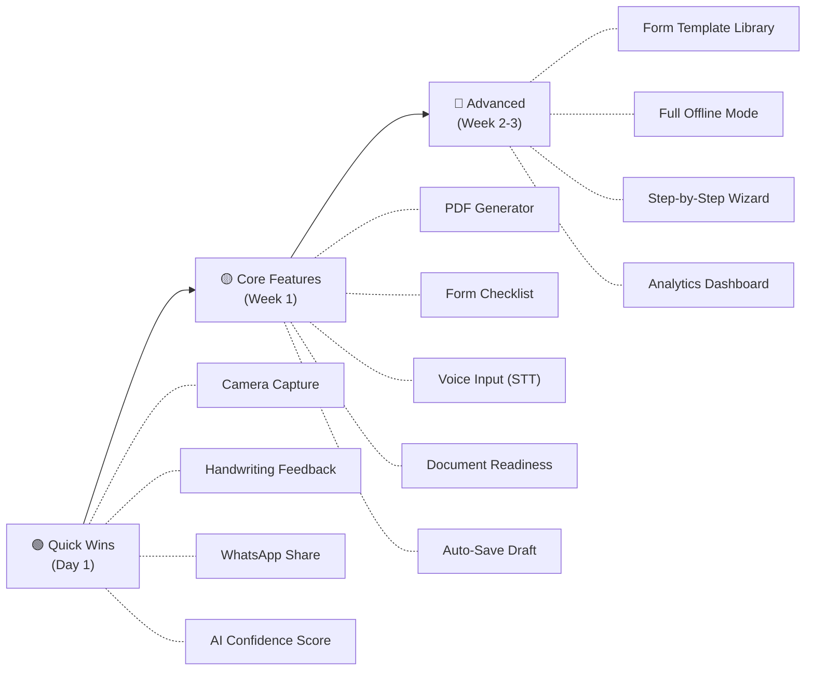

# 🚀 Form Sahayak — Feature Suggestions (Codebase Analysis के बाद)

> मैंने आपकी पूरी application को deeply analyze किया — [index.html](file:///d:/IdeaProjects/Form/index.html), [app.js](file:///d:/IdeaProjects/Form/js/app.js), [ai-service.js](file:///d:/IdeaProjects/Form/js/ai-service.js), [server.js](file:///d:/IdeaProjects/Form/backend/server.js), [speech-service.js](file:///d:/IdeaProjects/Form/js/speech-service.js), [feedback-service.js](file:///d:/IdeaProjects/Form/js/feedback-service.js), [ui-renderer.js](file:///d:/IdeaProjects/Form/js/ui-renderer.js) — और नीचे **specific, actionable** features suggest कर रहा हूँ।

---

## ✅ पहले से Implemented Features

| Feature | Where |
|---------|-------|
| AI Form Analysis (Image → JSON) | `ai-service.js` + `server.js` |
| Multi-Provider Support (Gemini, Claude, OpenAI) | `ai-service.js` |
| 14 Indian Languages | `app.js` LANGUAGES array |
| Text-to-Speech (Web Speech API) | `speech-service.js` |
| Chat-based UI with History (IndexedDB) | `chat-db.js` + `ui-renderer.js` |
| Dark/Light Theme Toggle | `index.html` + `design-system.css` |
| Image Paste, Drag-Drop, File Upload | `app.js` _handleFiles |
| Client-side Image Compression | `image-processor.js` |
| PWA + Service Worker | `sw.js` + `manifest.json` |
| Field-level Voice Playback | `app.js` field-voice-btn |
| Field-level Feedback | `feedback-service.js` |
| Text Follow-up Questions | `ai-service.js` sendTextMessage |
| Share Result (Web Share / Clipboard) | `app.js` _shareResult |
| Server-side LRU Cache | `server.js` templateCache |
| Rate Limiting | `server.js` express-rate-limit |
| Settings Modal (Voice Speed) | `index.html` settings |
| Chat Search | `app.js` _filterChats |
| Docker Support | `Dockerfile` |

---

## 🔥 Suggested New Features (Priority Order)

### 🏆 HIGH PRIORITY — Maximum User Impact

---

### 1. 📄 Filled Form PDF Generator
**क्या करेगा:** User form fields भरे → एक "printable filled reference sheet" PDF generate हो जो user bank ले जा सके  
**किसको फायदा:** Low-literacy users जो form भरने में डरते हैं — printed guide ले जा सकते हैं  
**कैसे implement करें:**
- Frontend: `jsPDF` library use करें
- AI result के fields को एक clean template में render करें
- "Download PDF" button AI result message के नीचे add करें
- `app.js` में `_downloadPDF()` method add करें

```javascript
// Example: app.js में add करें
async _downloadPDF() {
  const { jsPDF } = await import('jspdf');
  const doc = new jsPDF();
  doc.setFont('helvetica');
  doc.text(`Form Guide: ${this.lastResult.form_name}`, 20, 20);
  // ... fields render ...
  doc.save('form-guide.pdf');
}
```

**Effort:** 🟡 Medium (2-3 hours)

---

### 2. 📸 Camera Capture (Direct Photo)
**क्या करेगा:** Mobile users directly camera open करके form की photo ले सकें (gallery nahi)  
**किसको फायदा:** ज़्यादातर target users mobile pe हैं — gallery navigate करना extra step है  
**कैसे implement करें:**
- `index.html` में `chatFileInput` पर `capture="environment"` attribute add करें
- एक separate "Camera" button add करें alongside attach button

```html
<!-- index.html में change -->
<input type="file" id="chatCameraInput" accept="image/*" capture="environment" hidden />
<button id="chatCameraBtn" class="input-action-btn camera-btn" title="Camera se photo lo">
  📷
</button>
```

**Effort:** 🟢 Low (30 minutes)

---

### 3. 🔄 Auto-Save Draft / Form Progress
**क्या करेगा:** अगर user ने कुछ images attach किए या text लिखा, और page refresh हो गया, तो data restore हो जाए  
**किसको फायदा:** Low-bandwidth users जिनका network frequently drop होता है  
**कैसे implement करें:**
- `localStorage` में pending text + image thumbnails save करें (हर 3 seconds)
- `app.js` init() में check करें: `if (localStorage.getItem('fs_draft'))` → restore करें
- Send होने पर draft delete करें

**Effort:** 🟡 Medium (1-2 hours)

---

### 4. 📋 Form Field Checklist Mode
**क्या करेगा:** AI result के बाद, user हर field को "done ✅" mark कर सके — interactive checklist  
**किसको फायदा:** Users जो form भरते समय track करना चाहते हैं कि कौन सा field बाकी है  
**कैसे implement करें:**
- `ui-renderer.js` में हर field card पर एक checkbox add करें
- `localStorage` में progress save करें per chatId
- Progress bar दिखाएँ: "5/12 fields done"

```javascript
// ui-renderer.js में field card template update
<div class="field-checkbox-wrapper">
  <input type="checkbox" class="field-done-check" data-field-index="${i}" />
  <label>Done ✅</label>
</div>
```

**Effort:** 🟡 Medium (2 hours)

---

### 5. 🌐 Offline Mode (Full)
**क्या करेगा:** पिछले analyzed forms offline भी देखे जा सकें (SW cache + IndexedDB)  
**किसको फायदा:** Rural users with intermittent connectivity  
**कैसे implement करें:**
- `sw.js` में API responses cache करें
- `chat-db.js` में पुराने results IndexedDB से serve करें
- Offline banner दिखाएँ: "Offline mode — saved results dekh sakte hain"
- New analysis के लिए queue बनाएँ → online होते ही process करें

**Effort:** 🔴 High (4-5 hours)

---

### 🟡 MEDIUM PRIORITY — Great UX Improvements

---

### 6. ✍️ Handwriting Recognition Feedback
**क्या करेगा:** अगर form पहले से भरा हुआ है, AI बताए कि क्या handwriting readable है, कहीं कोई गलती तो नहीं  
**कैसे implement करें:**
- AI prompt में extra instruction add करें: "If handwritten text is visible, comment on legibility and possible errors"
- `ai-service.js` `_buildPrompt()` में conditional section add करें

**Effort:** 🟢 Low (30 minutes — just prompt change)

---

### 7. 🏦 Form Template Library
**क्या करेगा:** Common forms (SBI KYC, PAN Application, Passport, Aadhaar Update) की pre-loaded gallery जहाँ user bina photo upload kiye guide le sake  
**किसको फायदा:** Users जो form download करने से पहले समझना चाहते हैं  
**कैसे implement करें:**
- `templates/` folder बनाएँ with common form images + pre-cached AI results
- Sidebar या home screen पर "📚 Form Library" section add करें
- Pre-cached results load करें → no API call needed

```
templates/
├── sbi-account-opening.json
├── pan-application-49a.json
├── passport-application.json
├── aadhaar-update.json
└── ...
```

**Effort:** 🟡 Medium (3-4 hours)

---

### 8. 🔍 Smart Field Search
**क्या करेगा:** Long forms में user specific field search कर सके: "PAN number kahan bharein?"  
**किसको फायदा:** Complex multi-page forms (20+ fields) में quick navigation  
**कैसे implement करें:**
- Result message के ऊपर search bar add करें
- Client-side fuzzy search (fields array filter)
- Matching field highlight + scroll-to-field

**Effort:** 🟢 Low (1 hour)

---

### 9. 📊 Document Readiness Checker
**क्या करेगा:** Form analyze होने के बाद, "documents_needed" list से एक interactive checklist बनाएँ — user tick करे कि कौन से documents उसके पास हैं  
**किसको फायदा:** Bank जाने से पहले user confirm कर सके कि सब documents ready हैं  
**कैसे implement करें:**
- AI result में `documents_needed` array already आता है
- Interactive checklist UI बनाएँ with checkboxes
- "Ready to submit!" banner show करें जब सब checked हों

**Effort:** 🟢 Low (1-2 hours)

---

### 10. 🗣️ Voice Input (Speech-to-Text)
**क्या करेगा:** User बोल कर सवाल पूछ सके (follow-up questions), typing की ज़रूरत न हो  
**किसको फायदा:** Low-literacy users + elderly users  
**कैसे implement करें:**
- Voice button already exists → currently सिर्फ TTS करता है
- Web Speech Recognition API (`webkitSpeechRecognition`) add करें
- Long-press on voice button → STT mode activate
- Recognized text → chatTextInput में fill करें

```javascript
// speech-service.js में add करें
startRecognition(onResult) {
  const recognition = new (window.SpeechRecognition || window.webkitSpeechRecognition)();
  recognition.lang = this.selectedLang;
  recognition.interimResults = true;
  recognition.onresult = (event) => {
    const transcript = event.results[0][0].transcript;
    onResult(transcript);
  };
  recognition.start();
}
```

**Effort:** 🟡 Medium (2 hours)

---

### 🟢 LOW PRIORITY — Nice-to-Have

---

### 11. 📱 WhatsApp Share (Deep Link)
**क्या करेगा:** Result को directly WhatsApp पर share करें (family/helper को)  
**कैसे:** `whatsapp://send?text=...` deep link use करें  
**Effort:** 🟢 Very Low (20 minutes)

### 12. 🖨️ Print-Friendly View
**क्या करेगा:** AI result को clean print layout में दिखाएँ  
**कैसे:** `@media print` CSS rules + "Print" button  
**Effort:** 🟢 Low (1 hour)

### 13. 📏 Form Comparison
**क्या करेगा:** दो forms compare करें (जैसे SBI vs PNB account opening)  
**कैसे:** Side-by-side UI with field diff highlighting  
**Effort:** 🔴 High (5+ hours)

### 14. 🧮 EMI/Interest Calculator Widget
**क्या करेगा:** Loan forms analyze होने के बाद, built-in EMI calculator show करें  
**कैसे:** Simple JS calculator widget with loan amount, rate, tenure inputs  
**Effort:** 🟢 Low (1-2 hours)

### 15. 📝 Form Fill Assistant (Step-by-Step Wizard)
**क्या करेगा:** User को guided step-by-step mode में form भरवाए — एक-एक field prompt करे  
**कैसे:** Wizard UI component, field-by-field navigation with "Next" button  
**Effort:** 🔴 High (5+ hours)

### 16. 🔔 Notification Reminders
**क्या करेगा:** "आपने SBI KYC form analyze किया लेकिन submit नहीं किया — reminder"  
**कैसे:** Push Notifications API + `sw.js` notification support  
**Effort:** 🟡 Medium (3 hours)

### 17. 📈 User Analytics Dashboard
**क्या करेगा:** Admin panel जहाँ form type distribution, language preference, error rates दिखें  
**कैसे:** `server.js` में analytics endpoint + simple chart page  
**Effort:** 🟡 Medium (4 hours)

### 18. 🤖 AI Confidence Score
**क्या करेगा:** हर field explanation के साथ confidence indicator (🟢 High / 🟡 Medium / 🔴 Low)  
**कैसे:** AI prompt में "confidence" field add करें  
**Effort:** 🟢 Low (30 minutes — prompt change)

---

## 📊 Recommended Implementation Order



---

## ⚡ Top 3 Recommendations (Sabse Zyada Impact)

| Rank | Feature | Why |
|------|---------|-----|
| 🥇 | **Camera Capture** | Sabse simple, sabse zyada mobile users ko help — 30 min ka kaam |
| 🥈 | **PDF Generator** | Users bank ले जा सकें printed guide — real-world utility |
| 🥉 | **Form Field Checklist** | Interactive engagement badhata hai, user retention improve hota hai |

---

> [!TIP]
> Aap bataiye **kaunse features implement karne hain** — main turant code likhna shuru kar dunga! Multiple features ek saath bhi select kar sakte hain.
