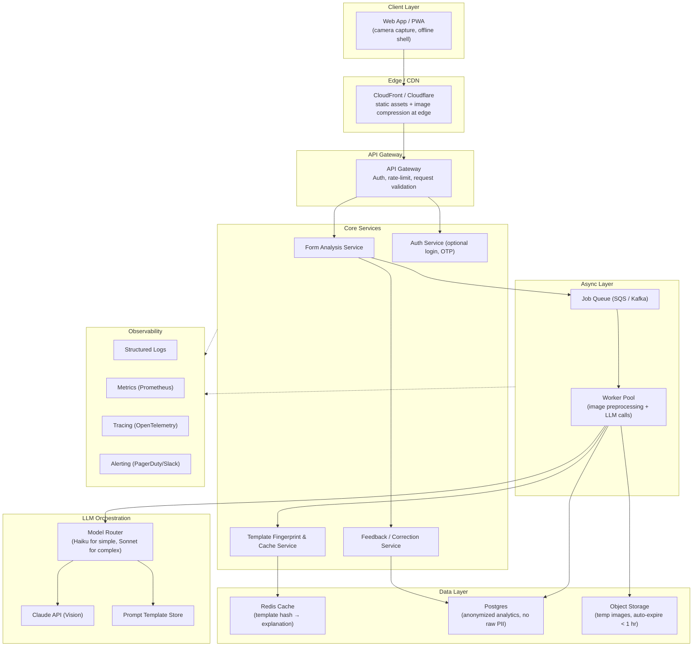
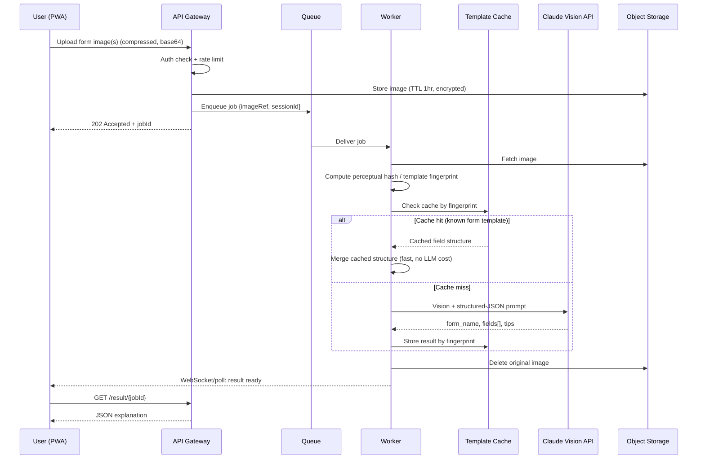
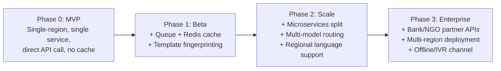
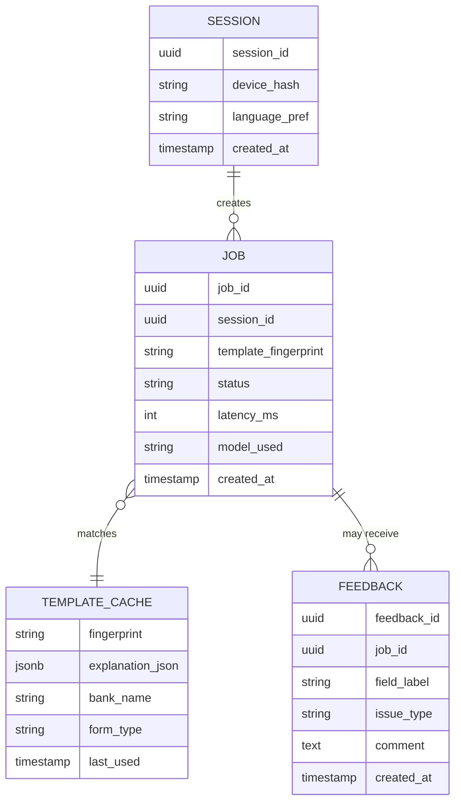

# Form Sahayak — Industry-Level System Architecture

**Vision:** Koi bhi Indian bank/government form ki photo upload karke, har literacy level ka user use kar sake, secure tareeke se PII handle ho, aur cost-efficient tarike se scale kar sake (lakhs of users) — yeh document MVP se lekar enterprise-scale architecture tak ka complete blueprint hai.

---

## 1. Design Principles

Industry-level banane ke liye ye 6 non-negotiable principles follow karenge:

| Principle | Kyun zaroori hai |
|---|---|
| **Privacy-by-default** | Forms mein PAN, Aadhaar, mobile, address jaisa sensitive PII hota hai — galti se leak hua to legal + trust dono cost |
| **Stateless image handling** | Image disk/DB par permanently store nahi honi chahiye — process karo, explain karo, delete karo |
| **Cost-aware AI usage** | Har request par vision-model call expensive hai — caching + model tiering zaroori |
| **Low-bandwidth first** | Target user 2G/3G aur entry-level phone pe ho sakta hai — payload chhota rakhna hai |
| **Graceful degradation** | LLM down ho ya rate-limit lage to bhi app crash na ho |
| **Human-in-the-loop safety net** | AI ka explanation kabhi galat ho sakta hai — disclaimer + "bank se confirm karo" har jagah |

---

## 2. High-Level Architecture

**Flow summary:** User photo leta hai → edge par hi compress hota hai → API gateway auth/rate-limit check karta hai → job queue mein jaata hai (taaki burst traffic backend ko crash na kare) → worker pehle check karta hai ki yeh form pehle dekha gaya hai (template fingerprint cache) → cache miss hone par hi Claude Vision API call hoti hai → result Redis mein cache hota hai → image immediately delete ho jaati hai → user ko sirf JSON explanation milta hai.

---

## 3. Request Flow (Sequence)

**Why queue + cache matters:** Bahut saare users same form (jaise standard KYC form) upload karenge. Template fingerprinting (perceptual hash of the form layout, ignoring handwritten/filled values) lets the system **reuse explanations** instead of calling the LLM every single time — yeh sabse bada cost lever hai.

---

## 4. Component Breakdown

### 4.1 Client (PWA)
- **Tech:** React/Next.js or plain HTML+JS (current prototype), installable as PWA
- Service worker for offline shell + retry queue if network drops mid-upload
- Client-side image compression (resize to max 1600px width, JPEG quality 70%) before upload — cuts payload 80-90%
- Multi-page capture flow with reordering
- Text-to-speech playback of explanations (for low-literacy users) using Web Speech API
- Language toggle: Hindi / Hinglish / regional (Marathi, Tamil, Bengali etc. — Phase 2)

### 4.2 API Gateway
- Auth (anonymous session token by default; optional phone-OTP login for history)
- Rate limiting per IP/device (prevent abuse, control LLM cost)
- Request size limits, file-type validation, virus/malware scan on upload

### 4.3 Form Analysis Service
- Orchestrates: store → fingerprint → cache lookup → LLM call → response shaping
- Idempotency: same jobId never double-processed

### 4.4 Template Fingerprint & Cache Service
- Generates a structural hash of the form (layout-based, not content-based, so it matches blank vs filled versions of the *same* form)
- Redis-backed; cache key = `bank:formtype:hash`
- Cache hit rate is the #1 KPI for cost control

### 4.5 LLM Orchestration ("Model Router")
- **Tiering logic:**
  - Known simple forms (cache hit) → no LLM call needed
  - New/unknown form, few fields → cheaper/faster model (e.g. Haiku-class)
  - Complex multi-page/dense form → Sonnet-class vision model
- Centralized prompt templates (versioned, A/B testable)
- Retry with exponential backoff on rate-limit/5xx
- Strict output schema validation (reject and retry once if JSON malformed)

### 4.6 Feedback Service
- "Yeh explanation sahi nahi tha" button → captures correction
- Feeds into a human-reviewed dataset to refine prompts over time (never auto-retrains the model directly — human review first)

### 4.7 Data Layer
- **Object Storage:** images, TTL ≤ 1 hour, server-side encryption, auto-delete lifecycle policy
- **Redis:** template-fingerprint → explanation cache
- **Postgres:** *only* anonymized/aggregated data — form type counts, language preference, error rates. **No raw form images or extracted PII ever persisted.**

### 4.8 Observability
- Structured JSON logs (no PII in logs — redact before logging)
- Metrics: cache hit rate, LLM latency, LLM error rate, cost per request, queue depth
- Tracing across gateway → queue → worker → LLM call
- Alerts: LLM error spike, queue backlog, cost-per-day threshold breach

---

## 5. Security & Compliance (India-specific)

This is the most critical section — forms in this product literally contain Aadhaar, PAN, address, DOB.

1. **Data minimization:** Never store the raw image or full extracted text after the response is sent. Process in memory/temp storage only.
2. **Encryption:** TLS 1.2+ in transit; AES-256 at rest for the short-lived temp storage.
3. **Aadhaar Act 2016, Section 29 & DPDP Act 2023 compliance:** Aadhaar numbers must not be stored unless explicitly licensed to do so — design assumes **we never persist Aadhaar/PAN values**, only field *labels and instructions*, not the user's actual filled values, in any log or database.
4. **Data localization:** Host in an India region (AWS ap-south-1 / Azure Central India) — relevant if this ever processes regulated financial data, and reduces latency too.
5. **PII redaction in prompts:** Where possible, instruct the model to describe *how to fill* a field rather than echoing back any already-handwritten values it sees.
6. **Auto-expiry everywhere:** Object storage lifecycle rule deletes images within 1 hour even if a worker crashes mid-job.
7. **Access control:** Internal dashboards (for admins reviewing feedback) require RBAC + audit logging.
8. **Vendor data processing agreement:** Anthropic API usage reviewed against data-retention settings (zero-data-retention mode where available) for an additional layer of safety.

---

## 6. Cost Optimization Strategy

| Lever | Impact |
|---|---|
| Template fingerprint caching | Eliminates repeat LLM calls for the *same* form layout — biggest lever |
| Client-side image compression | Smaller payloads = faster + cheaper |
| Model tiering (cheap model for simple/known forms) | Reduces average cost per request |
| Prompt compression (concise, structured JSON-only prompts) | Fewer output tokens = lower cost |
| Batch/async processing | Avoids over-provisioning real-time compute for spiky traffic |
| CDN edge caching for static assets | Reduces origin load |

---

## 7. Scalability Roadmap

- **Phase 0 (MVP — current state):** Single web artifact directly calling Claude API. Good for validation, not for scale (no caching, no queue, cost scales linearly with users).
- **Phase 1 (Beta):** Introduce job queue + Redis cache + object storage lifecycle. Adds resilience against traffic spikes and cuts LLM cost via caching.
- **Phase 2 (Scale):** Split into independent services (form analysis, feedback, template cache) so each scales independently. Add regional language models/prompts. Add voice (STT/TTS) layer for illiterate users.
- **Phase 3 (Enterprise):** Offer this as an API/widget that banks or NGOs (e.g., financial literacy programs, Common Service Centres) can embed. Multi-region deployment for latency + data residency per partner. Consider an **IVR/WhatsApp channel** — many target users are more comfortable with a phone call or WhatsApp than a web app.

---

## 8. Reliability & SLOs

| SLO | Target |
|---|---|
| API availability | 99.5% (MVP) → 99.9% (Scale phase) |
| P95 response time (cache hit) | < 1.5s |
| P95 response time (cache miss / LLM call) | < 8s |
| Error rate (LLM call failures surfaced to user) | < 2% |
| Cache hit rate | > 60% by Phase 2 |

**Failure handling:** If Claude API is down/rate-limited → show a friendly Hindi message ("Thodi der mein dobara try karein") with automatic retry, never a raw error stack to the user.

---

## 9. Recommended Tech Stack

| Layer | Recommendation | Why |
|---|---|---|
| Frontend | React/Next.js PWA | Offline shell, installable, large talent pool |
| API Gateway | AWS API Gateway / Nginx + custom middleware | Battle-tested, easy rate-limiting |
| Backend services | Node.js (TypeScript) or Python (FastAPI) | Fast to iterate, good async support |
| Queue | AWS SQS (simple) → Kafka (if multi-consumer needed later) | Decouples spikes from processing |
| Cache | Redis (managed — ElastiCache) | Sub-ms lookups for template cache |
| Object storage | S3 with lifecycle rules | Cheap, auto-expiry built in |
| Analytics DB | Postgres (managed — RDS) | Reliable, only stores anonymized data |
| AI | Claude API (vision) via Model Router | Already integrated, multilingual, strong vision+reasoning |
| Observability | OpenTelemetry + Prometheus/Grafana + Sentry | Standard, vendor-neutral |
| Hosting/region | AWS ap-south-1 (Mumbai) | Data residency + lowest latency for Indian users |
| CI/CD | GitHub Actions → staging → prod with manual gate | Safe, auditable releases |

---

## 10. Data Model (minimal, privacy-safe)

Note: **No table stores the user's actual filled-in values, Aadhaar, PAN, or raw images.** Only structural/aggregate data.

---

## 11. CI/CD & Environments

- **Environments:** `dev` → `staging` → `prod`, each with separate API keys and storage buckets
- **Pipeline:** lint → unit tests → integration test (mock LLM responses) → deploy to staging → manual smoke test → promote to prod
- **Secrets management:** Vault / AWS Secrets Manager — API keys never in code or client bundle
- **Feature flags:** for rolling out new languages/models gradually

---

## 12. Accessibility & Inclusion (core differentiator)

- **Voice output:** Read explanations aloud in Hindi/regional language (helps low-literacy users)
- **Voice input (Phase 2):** Let user *speak* the field instead of typing into the original form, and generate a printable filled-reference sheet
- **WhatsApp/IVR channel (Phase 3):** Many target users (especially older, rural) are far more comfortable sending a photo on WhatsApp than using a web app
- **Large-touch-target UI, high-contrast mode** for visually impaired/elderly users

---

## 13. Key Risks & Mitigations

| Risk | Mitigation |
|---|---|
| LLM misreads a field and gives wrong instruction | Always show disclaimer; encourage bank-staff confirmation; track feedback for high-error fields |
| Sensitive PII accidentally logged | Automated log-scrubbing + code review checklist + periodic audit |
| Cost runaway from viral growth | Hard per-day spend cap + alerting + cache-first design |
| Users distrust an AI with their KYC docs | Clear "we delete your photo after processing" messaging + no-login default mode |
| Forms in regional languages/scripts not recognized well | Start with Hindi/English (current coverage), expand via fine-tuned prompts per region, gather feedback |

---

## 14. Suggested Build Order (practical next steps)

1. Add backend (FastAPI/Node) between client and Claude API — stop calling Claude directly from browser (current MVP exposes nothing secret, but a backend is needed for caching/queueing/rate-limiting).
2. Add Redis + template fingerprinting — biggest cost/perf win, do this early.
3. Add image auto-delete + structured logging with PII scrubbing — do this **before** any real user data flows through, not after.
4. Add feedback button + lightweight admin review dashboard.
5. Add voice playback (quick win for accessibility, low engineering cost).
6. Then move to queue-based async processing once traffic justifies it.
7. Explore WhatsApp Business API channel as a growth/accessibility lever.

---

*Yeh document ek living blueprint hai — jaise jaise real usage data aata hai (kaunse forms zyada aate hain, kahan explanations galat hote hain), isko revise karte rehna chahiye.*
